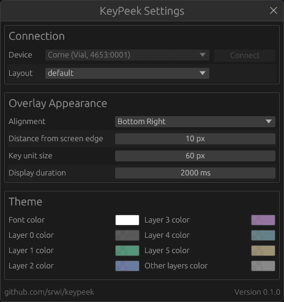

# KeyPeek 

KeyPeek provides a live on-screen overlay of your keyboard, mirroring the active base and momentary layers. It is especially useful when learning complex multi-layer layouts or using boards with missing legends. The overlay updates instantly when layers change, so the view always matches your firmware state.

It reflects the active layer stack (base + momentary), so the shown keys always match the current effective layout.
It supports QMK, Vial, and ZMK keyboards.


## Setup

KeyPeek requires a small firmware module because stock QMK/Vial/ZMK firmware does not expose live layer-change events.
The module adds that event stream over the device connection, so the overlay stays in sync with your active layers in real time.

### QMK and Vial

1. In your QMK userspace (or `qmk_firmware`) root, add the module repo:
   ```sh
   mkdir -p modules
   git submodule add https://github.com/srwi/qmk-modules.git modules/srwi
   git submodule update --init --recursive
   ```
2. In your keymap folder, add `srwi/keypeek_layer_notify` to `keymap.json`:
   ```json
   {
     "modules": [
       "srwi/keypeek_layer_notify"
     ]
   }
   ```
3. In the same keymap folder, enable RAW HID in `rules.mk`:
   ```make
   RAW_ENABLE = yes
   ```
4. Build and flash your firmware:
   ```sh
   qmk compile -kb <your_keyboard> -km <your_keymap>
   ```
5. QMK (VIA) only: export `keyboard_info.json`:
   ```sh
   qmk info -kb <your_keyboard> -m -f json > keyboard_info.json
   ```
   This is only required for QMK (VIA), because VIA does not provide physical layout data directly over the connection, while Vial does.

### ZMK

1. Add the KeyPeek module to your `zmk-config/config/west.yml`:
   ```yaml
   manifest:
     remotes:
       - name: zmkfirmware
         url-base: https://github.com/zmkfirmware
       - name: srwi
         url-base: https://github.com/srwi
     projects:
       - name: zmk
         remote: zmkfirmware
         revision: main
         import: app/west.yml
       - name: zmk-keypeek-layer-notifier
         remote: srwi
         revision: main
   ```
2. Run `west update` in your `zmk-config` workspace to fetch the module.
3. Enable ZMK Studio in `build.yaml` for the central (USB-connected) side by adding `snippet: studio-rpc-usb-uart` and `cmake-args: -DCONFIG_ZMK_STUDIO=y`, then build and flash.
4. KeyPeek reads layout and keymap directly from the device for ZMK.

## Usage

Devices are scanned when the app starts. For QMK you will be prompted to select the `keyboard_info.json` generated from your keymap when you connect. For Vial and ZMK, just select the connected device from the dropdown, since they provide layout information directly.

Appearance settings are saved to `settings.ini` in the app directory.



# License & Attribution

Parts of this project are based on code from [the VIA project](https://github.com/the-via/app), which is licensed under the GNU General Public License v3.0.
